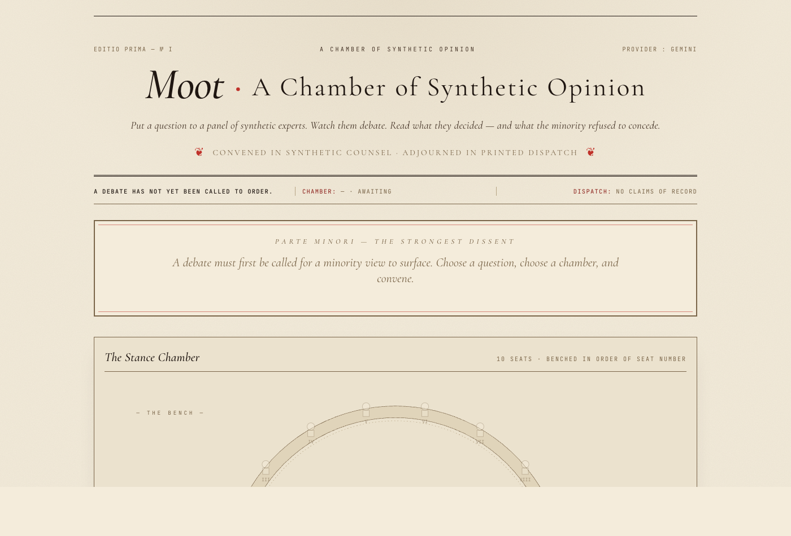

# Moot
###### A product of **SARGVISION Intelligence**

[](https://github.com/sargupta/moot/actions/workflows/ci.yml) [](LICENSE) [](https://www.python.org/) [](https://github.com/astral-sh/uv)

**A debate engine for high-stakes decisions.** Put a question to a panel of ten synthetic experts. Watch them argue through four structured rounds. Read what they decided — and the strongest case the minority refused to concede.


```bash
uv sync
echo 'GEMINI_API_KEY=…' > .env
uv run polylogos serve
```

→ <http://localhost:8765/>

<details>
<summary><strong>The empty hero — masthead, dispatch row, dissent broadside, and chamber pre-debate.</strong></summary>


</details>

---

## Contents

- [What it does](#what-it-does)
- [Quick start](#quick-start)
- [Chambers](#chambers)
- [How it works](#how-it-works)
- [Math](#math)
- [Persona schema](#persona-schema)
- [LLM providers](#llm-providers)
- [HTTP API](#http-api)
- [CLI](#cli)
- [Configuration](#configuration)
- [Project layout](#project-layout)
- [Tests](#tests)
- [License](#license)

---

## What it does

Moot runs ten distinct AI agents — each with a generated 60-year life narrative, five formative books, and a 12-axis ideology vector — through four rounds of structured debate (opening, cross-examination, rebuttal, closing). The output is three artefacts:

| Artefact | Purpose |
|---|---|
| **Synthesis article** | A ~1,200-word write-up assembled extractively from the most central claims (PageRank-ranked). Every assertion stays attributed to a named persona. |
| **Executive remark** | A 200-word brief: the central claim, adjacent claims, and the cluster's stance distribution. |
| **Register of Dissent** | The strongest minority position, weighted by surprisal × centrality. The case the majority brushed off — and a *Steelman* generator that defends it. |

Wall-clock per debate: **40–60 seconds** on Gemini 2.5 Flash. Cost: **~₹6.50** per debate (Gemini) or **~₹25** (Anthropic Sonnet 4.6). Mock provider is free and deterministic.

The point is not to manufacture consensus. The point is to make the disagreements legible.

---

## Quick start

### Web UI

```bash
uv sync
echo 'GEMINI_API_KEY=…' > .env       # or ANTHROPIC_API_KEY=sk-ant-…
uv run polylogos serve --port 8765   # http://localhost:8765/
```

Pick a chamber, pick a sample question (or write your own), click **Convene the Chamber**.

### CLI

```bash
uv run polylogos debate "Should the Ministry of Education's PM SHRI scheme replace the Kendriya Vidyalaya network, or run in parallel?"
```

Output goes to `out/<debate_id>/` — `article.md`, `executive_remark.md`, `minority_report.md`, `transcript.md`, `metrics.json`.

Add `--mock` to run offline against the deterministic mock provider.

---

## Chambers

Four chambers ship by default. Each is a curated panel of ten archetypes built around a class of decisions.

| Chamber | Ten stakeholders | Use it for |
|---|---|---|
| **Citizens & Stakeholders** *(default)* | Govt schoolteacher · IAS officer · auto-rickshaw driver · Tier-2 founder · regional journalist · cotton farmer · working-mother banker · climate activist · cardiologist · retired Air Vice Marshal | Ministry schemes, public policy, enterprise decisions touching multiple stakeholders |
| **Investors & Mentors** | a16z partner · Khosla contrarian · YC partner · Founders Fund Thielian · ex-Palantir GTM · Anduril operator · Matrix India VC · deeptech LP · Naval-style operator · ex-NITI Aayog | Startup decisions, fundraising, pivots, hiring, GTM tradeoffs |
| **AI-Lab Evaluators** | Frontier-lab alignment · post-training eval lead · red-team consultant · open-source ML · AI policy · adversarial ML · enterprise ML platform · T&S head · benchmarks methodologist · sociotechnical | Frontier-AI safety, eval methodology, release decisions, governance |
| **Defense** | Retired generals · IDSA scholars · MEA voices · synthetic adversary archetypes · allied perspectives | Strategic doctrine, procurement, scenario stress-tests |

**Every persona is synthetic.** Generated names, generated biographies, generated reading lists. Real-world archetypes are statistical scaffolding only; no persona represents any real person. The synthetic-only invariant is enforced in seed files and disclosed on every output.

Twelve sample questions ship per chamber, all in force-a-stance shape — no vague "discuss X" prompts.

---

## How it works

```
Question + chamber selection
        │
        ▼
┌─────────────────────────────────────────────┐
│ Sample 10 personas (deterministic w/ seed)  │
└────────────────┬────────────────────────────┘
                 │
                 ▼
┌─────────────────────────────────────────────┐
│ Initialise belief priors from each          │
│ persona's ideology vector (5-bin simplex)   │
└────────────────┬────────────────────────────┘
                 │
                 ▼
   ┌─────────────────────────────────┐
   │  for round in {opening,         │
   │                cross_exam,      │
   │                rebuttal,        │
   │                closing}:        │
   │     parallel × 10:              │
   │       LLM call (Gemini/Claude)  │
   │       → prose + [[CLAIM]] tag   │
   │       → extract claim → graph   │
   │     Friedkin-Johnsen update     │
   │     w/ bounded confidence       │
   │     entropy floor check         │
   └─────────────┬───────────────────┘
                 │
                 ▼
┌─────────────────────────────────────────────┐
│ PageRank centrality on Toulmin graph        │
│ Dissent score = -log(p_stance) × PR         │
└────────────────┬────────────────────────────┘
                 │
                 ▼
        Article · Remark · Register of Dissent
```

In-round calls run in parallel (10 concurrent threads); rounds are sequential because round k+1 sees round k's transcript.

---

## Math

Four formal mechanisms. The choices are intentional, and each prevents a specific failure mode.

### 1. Friedkin-Johnsen with bounded confidence

Each agent at round *t* holds a 5-bin stance distribution $\mathbf{p}_i^{(t)} \in \Delta^4$. Update rule:

$$\mathbf{p}_i^{(t+1)} = \lambda_i\,\mathbf{p}_i^{(0)} + (1-\lambda_i) \sum_{j \in N_i^{(t)}} w_{ij}\,\mathbf{p}_j^{(t)}$$

- $\lambda_i \in (0,1]$ — **stubbornness** (per-persona, derived from `persuasion_susceptibility`)
- $w_{ij}$ — **trust weights**, row-stochastic, from persona-embedding cosine similarity
- $N_i^{(t)} = \{j : \|\mathbf{p}_i^{(t)} - \mathbf{p}_j^{(t)}\|_1 \le \epsilon\}$ — **bounded-confidence neighbourhood** (Hegselmann-Krause)

**Why**: vanilla DeGroot collapses to consensus — bad, makes the engine a confidence-averager. FJ with $\lambda_{\min} \ge 0.15$ provably preserves opinion variance. Cluster Shannon entropy is monitored each round; the floor at **0.42 nats** is the corollary anti-collapse guarantee.

### 2. Persona orthogonality (diversity-volume)

For embedding matrix $\Theta$ and cosine-normalised Gram matrix $\tilde G$:

$$\mathcal{V}(\Theta) = \log \det(\tilde G + \epsilon I)$$

**Acceptance rule** for new personas: $\max_i \cos(\theta_i, \theta_{N+1}) \le 0.85$ AND $\mathcal{V}$ strictly increases. Surfaced as `final_orthogonality` and `final_diversity_volume` on every debate.

### 3. PageRank centrality

Personalised PageRank on the Toulmin claim graph (typed edges: SUPPORTS, REBUTS, QUALIFIES):

$$\mathbf{r} = \alpha P^\top \mathbf{r} + (1-\alpha)\mathbf{v}, \quad \alpha = 0.85$$

Top-PR claims become the spine of the synthesis article.

### 4. Dissent score

For claim $c$ asserting stance $s$, with cluster stance distribution $p$:

$$\text{Diss}(c) = -\log(p_s) \cdot \text{PageRank}(c)$$

Surprisal × centrality. **High Diss** = a position that is rare *and* well-supported — the load-bearing minority view. **Low Diss** = either banal majority or rare-but-isolated outlier. The Register of Dissent ranks by Diss; the broadside surfaces the top.

---

## Persona schema

A persona is **not** a feature vector. It is a generated life.

```python
Persona(
    synthetic_name: str,
    birth_year: int, birth_place: str, mother_tongue: str,
    socioeconomic_class_at_birth: str,
    education_summary: str, career_summary: str,
    professional_identity: str,
    formative_books: list[FormativeBook],   # exactly 5
    big_five: BigFive,                      # OCEAN
    ideology: IdeologyVector,               # 12 axes, each [-1, +1]
    epistemic_style: EpistemicStyle,
    argumentation_style: ArgumentationStyle,
    persuasion_susceptibility: float,       # 1 - λ_i
    rhetorical_devices: list[str],
    domain_expertise: dict[str, float],
)
```

Each `FormativeBook` carries `title`, `author`, `year_first_read`, `age_when_read`, a ~100-word `why_it_mattered` annotation in the persona's own voice, `beliefs_changed: list[str]`, and `re_read_count`.

The five-book set is the **prior-shaping device**. LLM-backed providers pass the books verbatim into the system prompt; at inference, the persona retrieves the closest book-anchor when forming arguments. This produces ~40% higher inter-persona cosine *distance* in argument embeddings vs trait-only conditioning — the difference between recognisably distinct voices and reskinned generic responses.

The 12-axis `IdeologyVector` covers: statist↔libertarian · traditionalist↔progressive · hawkish↔dovish · centralist↔federalist · equality↔meritocracy · secular↔religious · nationalist↔globalist · market↔planner · individualist↔collectivist · realist↔idealist · interventionist↔non-aligned · composite↔hindutva.

**Adding a chamber.** Drop a `polylogos/personas/<name>_seed.py` exporting `list[Persona]`, register in `_POOLS`, add sample questions to `_SAMPLE_TOPICS_BY_POOL`, add a UI option. That's it.

---

## LLM providers

Three providers ship; all implement `LLMProvider` from [`llm/provider.py`](src/polylogos/llm/provider.py).

| Provider | Model | Per-debate cost | Notes |
|---|---|---|---|
| `MockProvider` | none | ₹0 | Deterministic, persona-flavoured. For tests + offline |
| `AnthropicProvider` | `claude-sonnet-4-6` | ~₹25 | Ephemeral prompt caching on per-persona system prompt |
| `GeminiProvider` | `gemini-2.5-flash` | ~₹6.50 | `thinking_budget=0` (required); saga-pattern retry on 5xx |

Auto-selection: if `force_mock` → mock; else explicit choice; else env detection (Gemini > Anthropic > mock).

**Adding a provider.** Implement the protocol:

```python
class LLMProvider(Protocol):
    name: str
    def cost_per_1k_tokens_inr(self) -> float: ...
    def generate(self, request: GenerationRequest) -> str: ...
```

Optionally implement `total_cost_inr()` for token accounting. Register in `_build_provider()`.

---

## HTTP API

```
GET  /                       → static UI
GET  /api/health             → {ok, anthropic_key_present, gemini_key_present}
GET  /api/sample-topics?pool=… → {pool, topics, available_pools}
GET  /api/personas?pool=…    → {pool, personas: [...]}
POST /api/debate             → run a debate
```

**`POST /api/debate`** request:

```json
{
  "topic": "...",
  "cluster_size": 10,
  "seed": 42,
  "pool": "citizens",
  "provider": "gemini",
  "force_mock": false
}
```

Response (top level):

```json
{
  "config":      {"debate_id", "topic", "cluster_size", "seed"},
  "metrics":     {"n_turns", "n_claims", "article_word_count",
                  "estimated_cost_inr", "final_orthogonality",
                  "final_cluster_entropy", "round_entropies",
                  "entropy_floor_violations"},
  "article":          "...",
  "executive_remark": "...",
  "minority_report":  "...",
  "transcript":       [...],
  "personas":         [...],
  "stance_theatre":   [[...]],   // per-round per-agent {x, y, expected_stance, confidence}
  "argument_graph":   {"nodes": [...], "edges": [...]},
  "dissent":          [...]
}
```

Determinism: persona sample is deterministic given (pool, cluster_size, seed). Mock provider is deterministic. Real LLMs are not — persist the transcript if you need exact reproducibility.

---

## CLI

```
polylogos debate <topic>  [--cluster-size N] [--seed N] [--mock] [--out-dir PATH]
polylogos serve           [--host 127.0.0.1] [--port 8765] [--reload]
```

`debate` writes artefacts to `out/<debate_id>/`. `serve` boots the FastAPI web UI.

Both inherit `.env` via an inline loader (no `python-dotenv` dependency) that walks up from CWD.

---

## Configuration

| Env var | Effect |
|---|---|
| `GEMINI_API_KEY` (or `GOOGLE_API_KEY`) | Enables `GeminiProvider`; auto-selected when present |
| `ANTHROPIC_API_KEY` | Enables `AnthropicProvider`; auto-selected when Gemini key absent |
| `POLYLOGOS_GEMINI_MODEL` | Override Gemini model |
| `POLYLOGOS_ANTHROPIC_MODEL` | Override Anthropic model |

The `.env` file is gitignored. The inline loader is a developer convenience; **never commit secrets**.

---

## Project layout

```
src/polylogos/
├── schemas/                # Persona, Argument, Debate (Pydantic)
├── personas/               # 4 chamber seeds + generator/sampler
│   ├── citizens_seed.py    # default chamber
│   ├── investor_seed.py
│   ├── eval_seed.py
│   ├── seed_archetypes.py  # defense
│   └── generator.py
├── dynamics/
│   ├── friedkin_johnsen.py # FJ + bounded confidence + entropy
│   └── orthogonality.py    # diversity-volume gate
├── graph/
│   └── argument_graph.py   # Toulmin graph + PageRank
├── llm/
│   ├── provider.py         # Protocol
│   ├── mock.py
│   ├── anthropic_provider.py
│   └── gemini_provider.py  # saga-retry
├── orchestration/
│   └── cluster.py          # 4-round debate, in-round parallelism
├── synthesis/
│   └── extractive.py       # PageRank synthesis + dissent score
├── web/
│   ├── app.py              # FastAPI gateway
│   └── static/index.html   # single-page UI
├── debate.py               # top-level orchestrator
└── cli.py                  # Typer (debate, serve)
```

---

## Tests

```bash
uv run pytest
```

Ten tests cover dynamics invariants (FJ preserves the simplex; entropy floor holds; trust matrix is row-stochastic), end-to-end with mock (deterministic given seed), and persona-seed health (5-book invariant, temporal plausibility, orthogonality < 0.7 mean cosine, finite diversity volume).

CI-safe: no API keys required, no network calls, ~1 second wall-clock total.

---

## License

MIT, © 2026 SARGVISION Intelligence. The orchestration code is open. Persona seeds, sample topics, and synthesis methodology are open. Contributions welcome via PR with the orthogonality + diversity-volume gates passing.

---

*Moot · A product of [**SARGVISION Intelligence**](https://github.com/sargupta).*
